# CKAD Note Section 6 Pod Design

<br>

---

## 79. Labels, Selectors and Annotations

<br>


```yaml
apiVersion: v1
kind: Pod
metadata:
  name: label-demo
  labels:
    environment: production
    app: nginx
spec:
  containers:
  - name: nginx
    image: nginx:1.14.2
    ports:
    - containerPort: 80
```


我們可以在 kubernetes object 上貼上標籤 (labels) 用於分類。使用 `kubectl get pod --selector <key>=<value>` 可以篩選。


最後 Annotation 就是有點像註解的東西，給人看的 例如: build version, ~~on call 電話號碼~~ 之類的。label 可以幫助我們 select object，annotation 則否。

<br>

## 82. Rolling Updates & Rollbacks in Deployments

<br>

這邊主要介紹 rolling update strategy 是怎麼樣的概念，當我們部屬一個 deployment 就會觸發 rollout，可以透過 `kubectl rollout status deployment <name>` 查看 rollout 狀態。

<br>

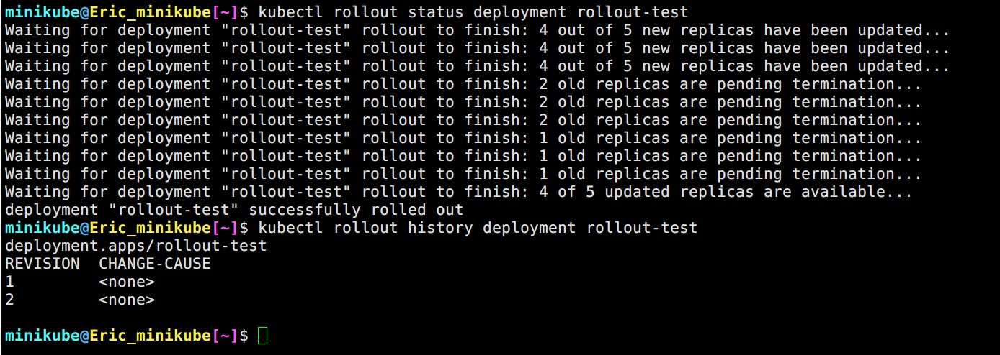

▲ log 由上至下。 `kubectl rollout history` 可以查看歷史。

<br>

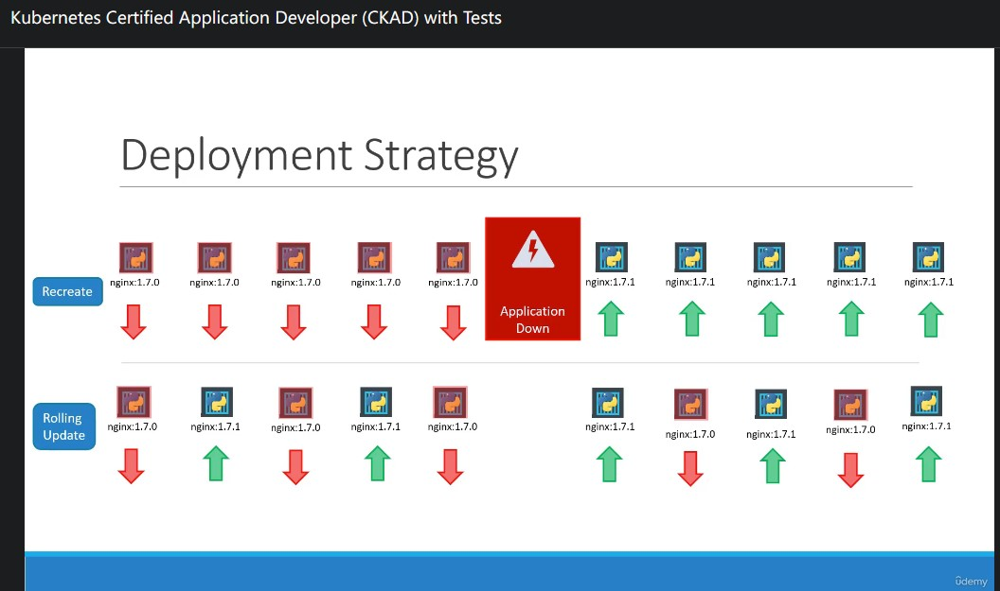

<br>

Kubernetes 預設使用 **rolling update** 策略 (strategy) 來更新 `pod`，比起 **recreate** 後者能夠確保服務不被中斷。\
`kubectl describe deployments.apps rollout-test` 能夠找到 `RollingUpdateStrategy:  25% max unavailable, 25% max surge`

<br>

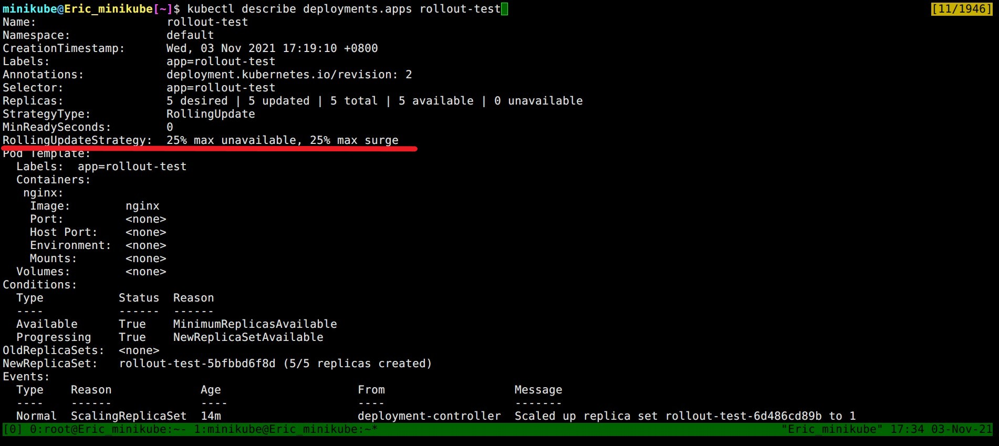

<br>

### rolling update 


首先 `kubectl create deployment nginx-rollout --image=nginx:1.20.1 --replicas=5`

<br>

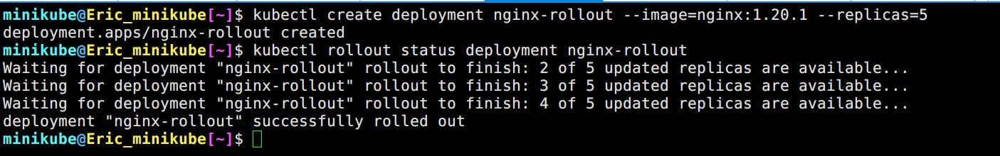

▲ `kubectl rollout status` 顯示完成

<br>

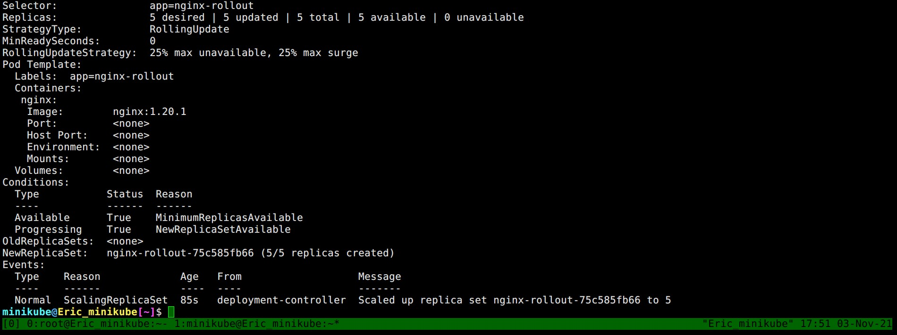

▲ `Events` 顯示 scale up replica set **<span style='color:red'>75c585fb66</span>** to 5

<br>

接著我們升級 `nginx -> 1.21`

<br>

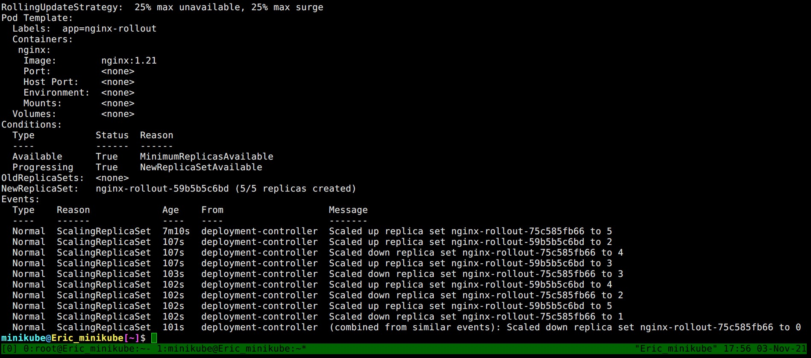

▲ 我們以 <span style='color:blue'>藍色</span>代表新的 replica set\
scale up replica set **<span style='color:blue'>59b5b5c6bd</span>** to 2\
scale down replica set **<span style='color:red'>75c585fb66</span>** to 4\
scale up replica set **<span style='color:blue'>59b5b5c6bd</span>** to 3\
scale down replica set **<span style='color:red'>75c585fb66</span>** to 3\
scale up replica set **<span style='color:blue'>59b5b5c6bd</span>** to 4\
scale down replica set **<span style='color:red'>75c585fb66</span>** to 2\
scale up replica set **<span style='color:blue'>59b5b5c6bd</span>** to 5 (達標)\
scale down replica set **<span style='color:red'>75c585fb66</span>** to 1\
(combined from similar events): Scaled down replica set <span style='color:red'>75c585fb66</span> to 0

<br>

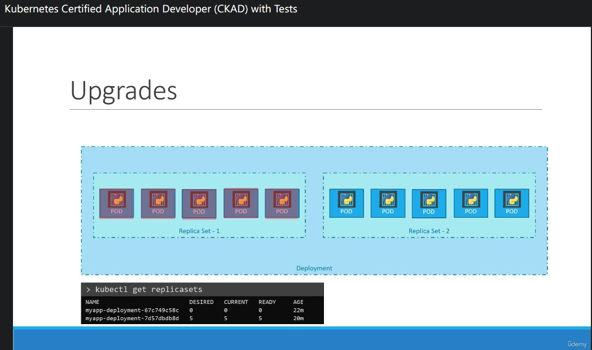

▲ 示意圖

<br>

### rollback


反悔了，來個 rollback 時光倒轉一下吧! `kubectl rollout undo deployment nginx-rollout`

<br>

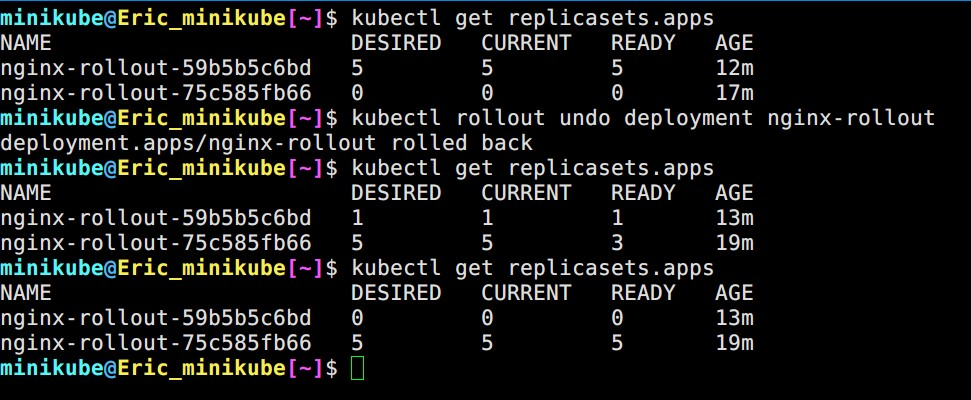

▲ 舊的 replicaset 又有東西囉~

<br>

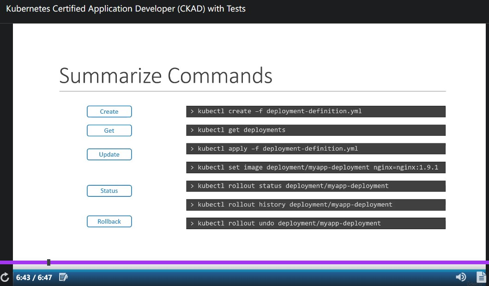

▲ 總結

<br>


## 83. Updating a Deployment


<br>

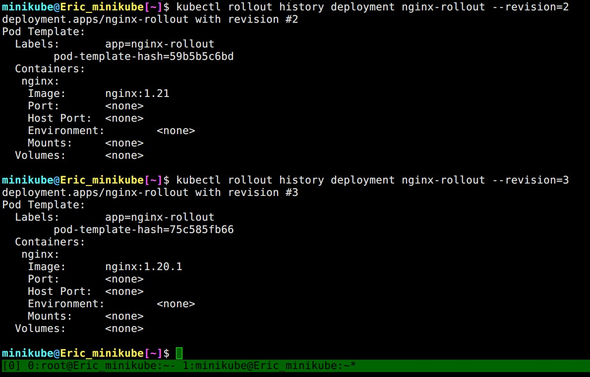

▲ 使用 `--revision=` 可以查看指定 revision

<br>

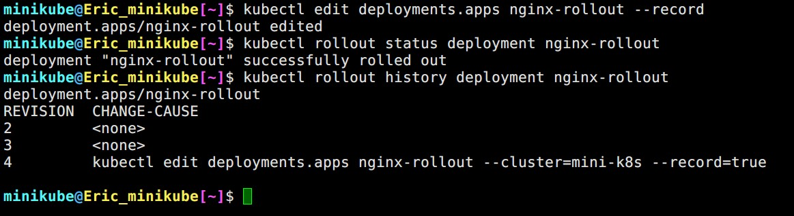

▲ 在 create/edit `deployment` 的時候使用 `--record`，可以把當次使用的命令紀錄到 `CAUSE` 欄位。

<br>

---

## 86. Jobs


<br>

**<span style='color:red'>Tips:</span>**


```bash
## kubectl create job NAME --image=image [--from=cronjob/name] -- [COMMAND] [args...] [options]
kubectl create job fast-job --image=centos:7 $dry -- sh -c "echo Hi" > fast-job.yml
```

<br>


`Jobs` 就像 Linux 的 `at` 一樣，**負責執行一次性工作** (參考資料: [小信豬 [Kubernetes] Job, CronJob & TTL Controller Overview](https://godleon.github.io/blog/Kubernetes/k8s-Job-Overview/))


我們直接 hands-on ~ 建立一個 `pod` 使用 `perl` 計算圓周率小數點後一位 (???)

<br>

```yaml
apiVersion: v1
kind: Pod
metadata:
  labels:
    run: pi-pod
  name: pi-pod
spec:
  containers:
  - image: perl
    name: pi-pod
    command: ["perl",  "-Mbignum=bpi", "-wle", "print bpi(2)"]
```

<br>

接著用 `kubectl get pod pi-pod` 觀察 `pod` 的變化

<br>

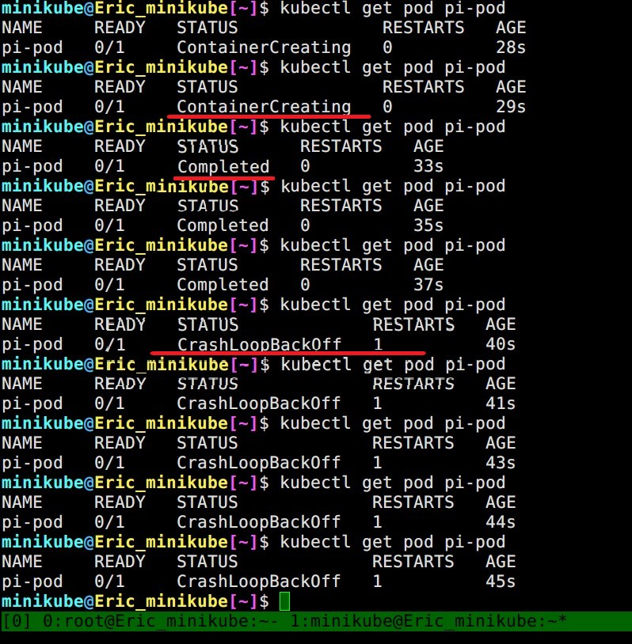

▲ 狀態從 ContainerCreating -> Complete -> CrashLoopBackOff (Restart:1)，好像哪裡怪怪的... 都 Complete 了怎麼會有 `restart` 呢?

<br>

其實這跟 Kubernetes 預設的 `restartPolicy` 有關。當 K8s 偵測到 `pod` 裡面的 container failed/exited 就會很熱心地去 `restart` 人家~


<br>

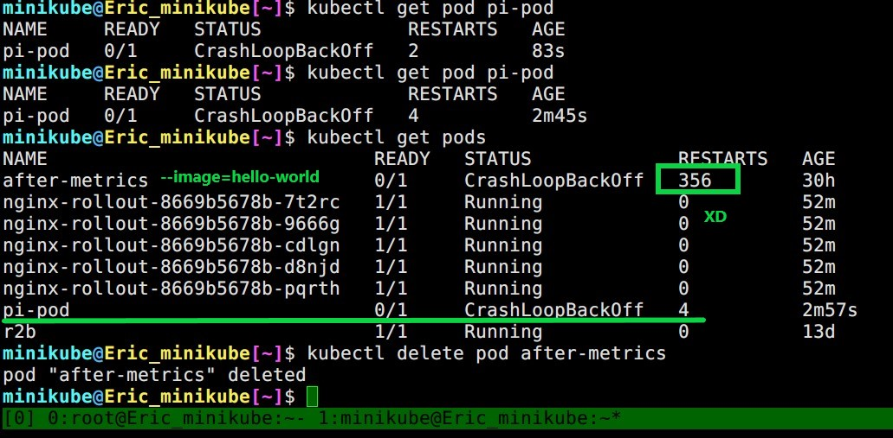

▲ 同場加映，昨天我用 `--image=hello-world` 建立的 `pod` 已經 `restart` 356 次了 XD 因為 hello-world 這個 image 只做一件事情: 顯示 Hello World 後 Exited (0)\
然後就被 Kubernetes 一直 `restart` 惹 QQ

<br>

**<span style='color:red'>上面的例子讓我們知道一件事: Pod 不適合跑一次性的工作</span>**\
可是你可能會想說: 那把 `restartPolicy: Never` 就好了呀~ No no no! `Job` 能夠幫我們做更多事 :)


我們在來把剛剛的 `pod` 改成 `job`:


```yaml
apiVersion: batch/v1
kind: Job
metadata:
  name: pi-job
spec:
  template:
    metadata:
      creationTimestamp: null
    spec:
      containers:
      - image: perl
        name: pi-job
        command: ["perl",  "-Mbignum=bpi", "-wle", "print bpi(2)"]
      restartPolicy: Never
```

<br>

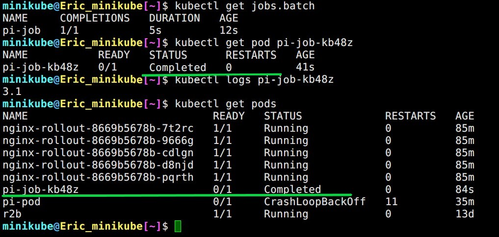

▲ 當 job 執行完成後 `STATUS` 會變成 `Complete` 不會被 K8s 一直雞婆 `restart`。

<br>

`job` 同時可以執行多次、同時執行 (parallelism)


<br>

```yaml
apiVersion: batch/v1
kind: Job
metadata:
  name: pi-job
spec:
  completions: 50
  parallelism: 2
  template:
    metadata:
      creationTimestamp: null
    spec:
      containers:
      - image: perl
        name: pi-job
        command: ["perl",  "-Mbignum=bpi", "-wle", "print bpi(2)"]
      restartPolicy: Never
```

<br>

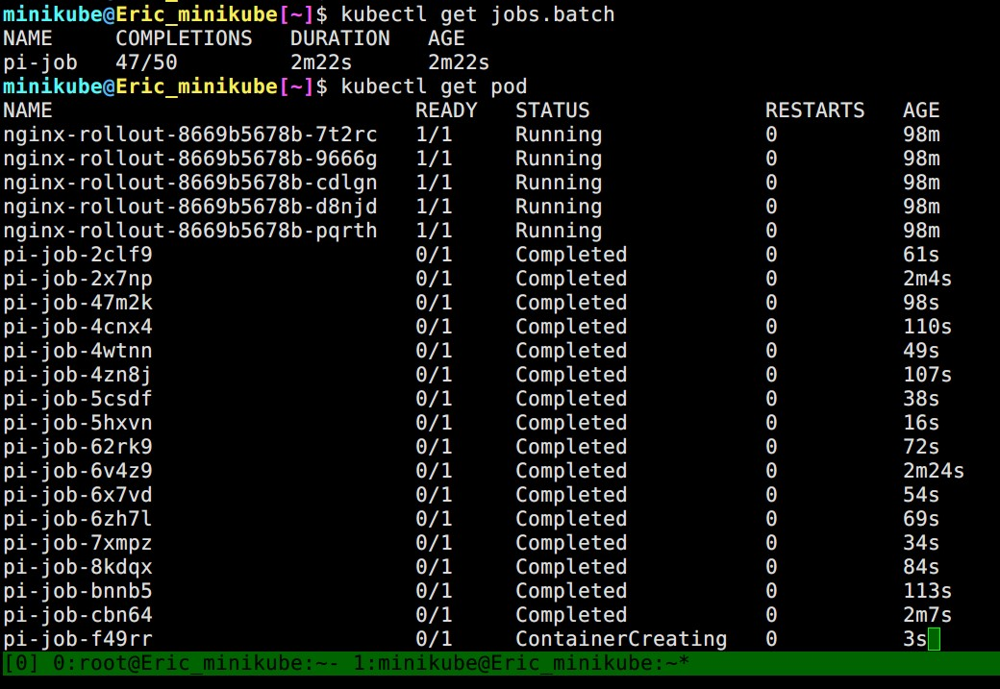

▲ 目標完成: 50，同時執行: 3

<br>

### backoffLimit


`Job` 在 `.spec.backoffLimit` **<span style='color:red'>預設值是 `6`</span>**，這個設定值定義當 `pod` failed 幾次之後就終止此 `Job`。


---

## 87. CronJob


就跟 Linux 的 cronjob 一樣，定時執行。比較特別的是 `CronJob` 有三個 `spec`:
1. `CronJob` 的
2. `Job` 的
3. `Pod` 的

<br>

```yml
apiVersion: batch/v1
kind: CronJob
metadata:
  name: hello
spec:
  schedule: "*/1 * * * *"
  jobTemplate:
    spec:
      template:
        spec:
          containers:
          - name: hello
            image: busybox
            imagePullPolicy: IfNotPresent
            command:
            - /bin/sh
            - -c
            - date; echo Hello from the Kubernetes cluster
          restartPolicy: OnFailure
```

<br>

